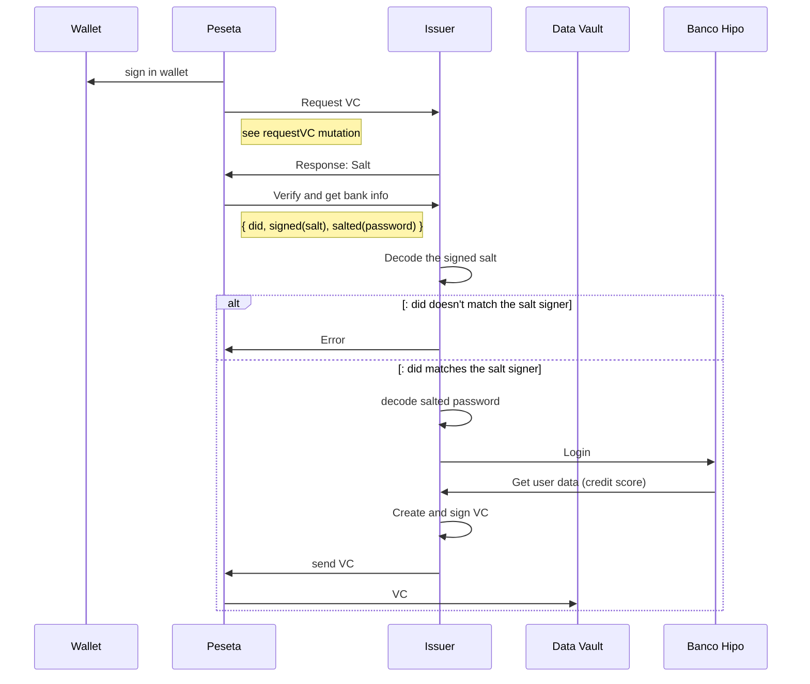

# vc-issuer
Verifiable Credential Issuer, built using [RIdentity](https://www.rifos.org/identity) tools

Code is derived from [Bankathon backend](https://github.com/growr-xyz/growr-on-chain-backend).

## Setting up environment

create .env file

```
DB_HOST=mongodb
DB_PORT=27017
BANK_APP_KEY=<customer key for banco hipotecario sandbox>
PRIVATE_KEY=<random 32 bytes>
```

**DB_HOST** should be `mongodb` if running in docker environment, or `localhost` if the Isser runs as local service

## Installation

1. Clone this repo
`$ git clone git@github.com:https://github.com/growr-xyz/vc-issuer`
2. Build docker image
`$ docker build --no-cache -t <docker-username>/<image-name>:<image-version> .`
3. Run docker-compose build script
`$ docker compose build`
4. Run docker-compose up script
`$ docker compose up -d`
5. Open GraphQL playground with browser at `http://localhost:4000`


## GraphQL

1. Request verification:

```graphql
mutation requestVC($did: String, $type: String, $subject: String) {
	requestVerification($did, $type, $subject)
}
```

response should look like:

```json
{
	"data": {
		"requestVerification": "ea2823bb684cd67e382149066dc4b7400acd3fdaa468c07ff6312b65d3c92fa6"
	}
}
```

Currently subject is used to pass BH username.

The `receivedVerification` value should be signed by the did and used as `message` parameter in the next query.
Currently the `receivedVerification` value should be used to encrypt the password:

In next versions the code should be passed on another channel - email or sms.


```js
const CryptoJS = require('crypto-js')

const password = CryptoJS.AES.encrypt('X!c9a49d53', receivedVerification).toString();
```

both signed `message` and AES generated `password` should be used in the following graphQL query to request VC

1. Request VC

```graphql
query bankVC($did: String, $message: String, $parameters: String) {
	bankVC($did, $message, parameters: password)
}

```

## Flow

Current flow


