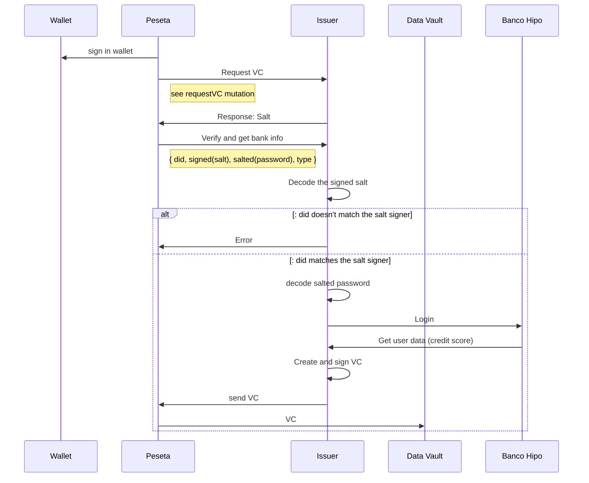

# vc-issuer
POC of Verifiable Credential Issuer and Risk Assessor, built using [RIdentity](https://www.rifos.org/identity) tools

Code is derived from [Bankathon backend](https://github.com/growr-xyz/growr-on-chain-backend).

## Setting up environment

1. If local node is used, run, deploy and seed contracts from [core protocol repo](https://github.com/growr-xyz/growr-core-protocol/)
	#### NOTE
		Add Verifier identity in the deploy and seed [script](https://github.com/growr-xyz/growr-core-protocol/blob/7063b6e8fc9668c3281e13a206232eebf83379c6/scripts/dev/deploy-and-seed.js#L51).
		To 

2. This should work with [SSFI demo app](https://github.com/growr-xyz/growr-ssfi-agent-app)

### create .env file

example .env file

```
DB_HOST=mongodb
DB_PORT=27017
BANK_APP_KEY=null
PRIVATE_KEY=<random 32 bytes>
VERIFICATION_REGISTRY_ADDRESS=<address of the Verification Registry contract>
NODE_HOST=<host of the node>
```

**VERIFICATION_REGISTRY_ADDRESS** should be recevied from core protocol deployment
**DB_HOST** should be `mongodb` if running in docker environment, or `localhost` if the Isser runs as local service
**PRIVATE_KEY** is used to create Issuer identity and Risk Assesor contract


## Installation

1. Clone this repo
`$ git clone git@github.com:https://github.com/growr-xyz/vc-issuer`, 
	then initialise the submodules by running:
`$ git submodule init` and `$ git submodule update`
1. Build docker image
`$ docker build --no-cache -t <docker-username>/<image-name>:<image-version> .`
3. Run docker-compose build script
`$ docker compose build`
4. Run docker-compose up script
`$ docker compose up -d`
5. Open GraphQL playground with browser at `http://localhost:4000`


## GraphQL

1. Request verification:

```graphql
mutation requestVC($did: String, $type: String, $subject: String) {
	requestVerification($did, $type, $subject)
}
```

### Types

Currently only atomic VC types are working:

  - [x] dateOfBirth
  - [x] relationshipStatus
  - [ ] dependants
  - [x] education
  - [x] employmentStatus
  - [x] highestEducationAttained
  - [x] kycStatus
  - [ ] bankVCs
  - [ ] creditRating

response should look like:

```json
{
	"data": {
		"requestVerification": "ea2823bb684cd67e382149066dc4b7400acd3fdaa468c07ff6312b65d3c92fa6"
	}
}
```

Used to pass BH username.

The `receivedVerification` value should be signed by the did and used as `message` parameter in the next query.
Currently the `receivedVerification` value should be used to encrypt the password:

In next versions the code should be passed on another channel - email or sms.


```js
const CryptoJS = require('crypto-js')

const password = CryptoJS.AES.encrypt('X!c9a49d53', receivedVerification).toString();
```

both signed `message` and AES generated `password` should be used in the following graphQL query to request VC

2. Request VC

```graphql
    query bankVC($did: String, $message: String, $type: VCTypeEnum, $parameters: String) {
      bankVC(did:$did, message:$message, parameters: $parameters, type: $type)
    }
```

Response:

```json
{
    "data": {
        "bankVC": "eyJhbGciOiJFUzI1NksiLCJ0eXAiOiJKV1QifQ.eyJ2YyI6eyJAY29udGV4dCI6WyJodHRwczovL3d3dy53My5vcmcvMjAxOC9jcmVkZW50aWFscy92MSJdLCJ0eXBlIjpbIlZlcmlmaWFibGVDcmVkZW50aWFsIiwiRGF0ZU9mQmlydGgiXSwiY3JlZGVudGlhbFNjaGVtYSI6eyJpZCI6ImRpZDpldGhyOnJzazoweDZhMzAzNWVjMzEzN2JlZWI2Nzg5ZmZhOTA4OThjY2FkNWNkMDZmNzk7aWQ9MDkzZWNkOTgtNDJkMC00ZWZjLTg5NTAtZjhjYmYwZWFhZDM1O3ZlcnNpb249MS4wIiwidHlwZSI6Ikpzb25TY2hlbWFWYWxpZGF0b3IyMDE4In0sImNyZWRlbnRpYWxTdWJqZWN0Ijp7ImRhdGVPZkJpcnRoIjoiMjAyMS0xMS0xNyJ9fSwic3ViIjoiZGlkIiwibmJmIjoxNjQ4MDI4MjAwLCJpc3MiOiJkaWQ6ZXRocjpyc2s6MHg3RkRiYjFDQjNDMmVEMzU3NEMwNTg2Nzk5Y0NCMTRCRjE3MkE5RjEyIn0._nmmp_xrpcIZbeGG0uDEMnwGYFnrPAxjrULXmexehCQ3SGYwTrPp0Z77yOpGu1sb2-pEhn9UPpIX-wZSUFiZYA"
    }
}
```

3. Verify Credentials match pond

```graphql
mutation verifyVCs{
  verifyVCs(did:"did:ethr:rsk:0x6a3035ec3137beeb6789ffa90898ccad5cd06f79", 
	vps:["eyJhbGciOiJFUzI1NksiLCJ0eXAiOiJKV1QifQ.eyJ2YyI6eyJAY29udGV4dCI6WyJodHRwczovL3d3dy53My5vcmcvMjAxOC9jcmVkZW50aWFscy92MSJdLCJ0eXBlIjpbIlZlcmlmaWFibGVDcmVkZW50aWFsIiwiQ2l0aXplbnNoaXAiXSwiY3JlZGVudGlhbFNjaGVtYSI6eyJpZCI6ImRpZDpldGhyOnJzazoweDZhMzAzNWVjMzEzN2JlZWI2Nzg5ZmZhOTA4OThjY2FkNWNkMDZmNzk7aWQ9MjM3MzBhMWQtOGYyNS00YzZhLWI1MjctN2Y4YWQ5MDFlZWE5O3ZlcnNpb249MS4wIiwidHlwZSI6Ikpzb25TY2hlbWFWYWxpZGF0b3IyMDE4In0sImNyZWRlbnRpYWxTdWJqZWN0Ijp7IkNpdGl6ZW5zaGlwIjoiU1YifX0sInN1YiI6ImRpZDpldGhyOnJzazoweDZhMzAzNWVjMzEzN2JlZWI2Nzg5ZmZhOTA4OThjY2FkNWNkMDZmNzkiLCJuYmYiOjE2NDg5NzU5OTEsImlzcyI6ImRpZDpldGhyOnJzazoweDdGRGJiMUNCM0MyZUQzNTc0QzA1ODY3OTljQ0IxNEJGMTcyQTlGMTIifQ.A_vnZO7yudlvvVnIZ7zmZ6Ce_e1Ypg9LL52UCx3uBiVxk0fIUrJjrede0DbXjKlTT87oDWZJRPssQb6kQeXlnw"], 
	pondAddress:"0x94099942864EA81cCF197E9D71ac53310b1468D8")
}
```

Response: 

```json
{
  "data": {
    "verifyVCs": true
  }
}
```
## Flow

Current flow


